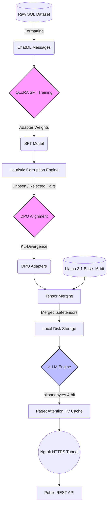

#  Enterprise SQL Code Generation: Llama 3.1 Alignment & vLLM Deployment

An end-to-end MLOps Proof-of-Concept (PoC) demonstrating how to fine-tune, preference-align, and deploy an open-source LLM for deterministic SQL generation under strict hardware constraints (Free Google Colab 15GB T4 GPU).

##  Project Overview
This project builds a complete infrastructure pipeline to align **Llama-3.1-8B-Instruct** to generate strict, syntactically valid SQL queries based on custom database schemas, with zero conversational filler. 

The pipeline spans Supervised Fine-Tuning (SFT), Direct Preference Optimization (DPO), LoRA adapter merging, and dynamic 4-bit quantized serving via a headless vLLM API.

##  System Architecture


##  Tech Stack
* **Base Model:** Meta Llama 3.1 8B Instruct
* **Training Engine:** Unsloth (for 2x faster, VRAM-optimized training) & Hugging Face `trl`
* **Alignment:** QLoRA (Rank 16) + Direct Preference Optimization (DPO)
* **Serving Backend:** vLLM (OpenAI-Compatible REST API)
* **Quantization:** `bitsandbytes` (NF4) for on-the-fly memory compression
* **Networking:** PyNgrok for secure HTTPS tunneling bypassing cloud firewalls

##  Pipeline Breakdown
1. **Data Engineering:** Ingested the `b-mc2/sql-create-context` dataset, transforming rows into strict ChatML `messages` format. Engineered a custom Regex Heuristic Corruption Engine to generate DPO negative pairs (penalizing flipped operators, bad aggregations, and column hallucinations).
2. **SFT (Supervised Fine-Tuning):** Trained QLoRA adapters on the target format to enforce Markdown-only SQL outputs.
3. **DPO (Direct Preference Optimization):** Aligned the model against the heuristic negative pairs using KL-divergence penalties to actively suppress hallucination patterns.
4. **Tensor Merging:** Fused the DPO LoRA adapters into the base FP16 weights, yielding a standalone 15GB `.safetensors` artifact to avoid cloud transfer bottlenecks.
5. **vLLM Deployment:** Deployed a headless API server. Mitigated CUDA Out-Of-Memory (OOM) crashes and Graph Deadlocks by enforcing eager execution and injecting 4-bit dynamic quantization during inference (reducing VRAM footprint from 14.0GB to 5.6GB).

##  V1 Inference Diagnostics & V2 Mitigation Roadmap
As a PoC, V1 was designed to validate the deployment infrastructure under limited compute (100 training steps). While the architectural plumbing succeeded, the severe undertraining resulted in expected semantic degradation.

**Observed V1 Flaws:**
* **Over-Engineering:** The model favored complex `GROUP BY` and `MAX()` aggregations over simple `ORDER BY` logic for basic lookups.
* **Token Fragmentation:** DPO policy drift caused occasional syntax breakdown (e.g., evaluating string hyphens as mathematical subtraction).

**V2 Mitigation Plan (Infrastructure validated, ready for scale):**
* **Address Under-training:** Expand SFT from 100 steps to 1 full epoch (74k samples) to build generalized SQL logic mapping.
* **Halt Policy Drift:** Reduce DPO learning rate to 1e-5 and increase the beta penalty to 0.2 to restrict divergence from the base Llama 3.1 intelligence.
* **Protect Semantic Reasoning:** Remove MLP targets (`gate_proj`, `up_proj`, `down_proj`) from the LoRA configuration. Targeting only attention matrices (`q, k, v, o`) will enforce SQL structure without corrupting the model's fundamental linguistic reasoning.

##  How to Run (Local Inference Demo)
If you wish to run a rapid 60-second inference test locally (bypassing the heavy vLLM production server), use the Unsloth execution script:

```python
from unsloth import FastLanguageModel
import torch

# Load the DPO Adapters directly in 4-bit
model, tokenizer = FastLanguageModel.from_pretrained(
    model_name = "path/to/your/lora_dpo_final_model",
    max_seq_length = 2048,
    load_in_4bit = True,
)
FastLanguageModel.for_inference(model)

# Define Payload & Generate
messages = [
    {"role": "system", "content": "You are an expert SQL assistant. Return only the SQL query inside a markdown code block."},
    {"role": "user", "content": "Database Schema: CREATE TABLE users (id INT, age INT); \nQuestion: Find users over 30."}
]
prompt = tokenizer.apply_chat_template(messages, tokenize=True, add_generation_prompt=True, return_tensors="pt").to("cuda")
outputs = model.generate(**prompt, max_new_tokens=128, use_cache=True, do_sample=False)
print(tokenizer.decode(outputs[0][prompt["input_ids"].shape[1]:], skip_special_tokens=True))
```
